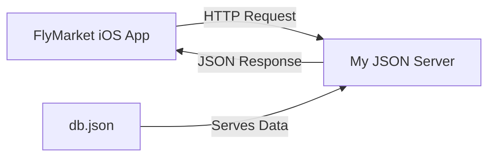

# 🗄️ FlyMarketBD

JSON Server backend for the **FlyMarket** iOS application. This repository provides a mock REST API using [My JSON Server](https://my-json-server.typicode.com/) to simulate a real backend for the in-flight shopping experience.

<p align="center">
  
  
  
  
</p>

## 📋 Table of Contents

* [Overview](#-overview)
* [API Endpoints](#-api-endpoints)
* [Database Structure](#-database-structure)
* [Usage](#-usage)
* [Local Development](#-local-development)
* [Integration with FlyMarket](#-integration-with-flymarket)
* [Contributing](#-contributing)

## 🎯 Overview

FlyMarketBD serves as the backend data source for the [FlyMarket](https://github.com/Arnau-RR/FlyMarket) iOS application. It provides:

- ✈️ Product catalog for in-flight items
- 📦 Mock REST API endpoints
- 🚀 Zero-configuration setup via My JSON Server
- 🔄 Automatic API generation from `db.json`

## 🌐 API Endpoints

The API is automatically available at:

```
https://my-json-server.typicode.com/Arnau-RR/FlyMarketBD
```

### Available Endpoints

| Method | Endpoint | Description |
|--------|----------|-------------|
| `GET` | `/products` | Get all products |
| `GET` | `/products/:id` | Get single product by ID |
| `GET` | `/categories` | Get all categories |
| `GET` | `/categories/:id` | Get single category |

### Example Requests

```bash
# Get all products
curl https://my-json-server.typicode.com/Arnau-RR/FlyMarketBD/products

# Get product by ID
curl https://my-json-server.typicode.com/Arnau-RR/FlyMarketBD/products/1

# Get all categories
curl https://my-json-server.typicode.com/Arnau-RR/FlyMarketBD/categories
```

## 📊 Database Structure

The `db.json` file contains the complete data structure:

```json
{
  "products": [
    {
      "id": 1,
      "name": "Product Name",
      "price": 29.99,
      "description": "Product description",
      "category": "CategoryName",
      "imageUrl": "https://example.com/image.jpg"
    }
  ],
  "categories": [
    {
      "id": 1,
      "name": "Category Name",
      "icon": "category-icon"
    }
  ]
}
```

*Adjust the structure according to your actual `db.json` file.*

## 🚀 Usage

### For FlyMarket App Developers

Simply use the base URL in your iOS app:

```swift
let baseURL = "https://my-json-server.typicode.com/Arnau-RR/FlyMarketBD"

// Fetch products
let productsURL = "\(baseURL)/products"
```

### Testing the API

You can test endpoints directly in your browser or using tools like:
- 🌐 Browser: Visit the endpoints directly
- 📮 Postman: Import and test API calls
- 💻 cURL: Use command line requests

## 💻 Local Development

To run a local JSON server for development:

1️⃣ **Install JSON Server:**

```bash
npm install -g json-server
```

2️⃣ **Clone this repository:**

```bash
git clone https://github.com/Arnau-RR/FlyMarketBD.git
cd FlyMarketBD
```

3️⃣ **Start the local server:**

```bash
json-server --watch db.json --port 3000
```

4️⃣ **Access locally:**

```
http://localhost:3000
```

### Local Endpoints

```
http://localhost:3000/products
http://localhost:3000/products/1
http://localhost:3000/categories
```

## 🔗 Integration with FlyMarket

This backend is designed to work seamlessly with the [FlyMarket iOS app](https://github.com/Arnau-RR/FlyMarket).



## ✏️ Modifying Data

To update the product catalog:

1. **Fork** this repository
2. **Edit** `db.json` with your data
3. **Commit** and push changes
4. **Access** your data at:
   ```
   https://my-json-server.typicode.com/YOUR_USERNAME/FlyMarketBD
   ```

## 🤝 Contributing

Contributions are welcome! To contribute:

1. **Fork** the repository
2. **Create** a feature branch
   ```bash
   git checkout -b feature/add-new-products
   ```
3. **Edit** `db.json` with your changes
4. **Commit** your changes
   ```bash
   git commit -m 'Add new product categories'
   ```
5. **Push** to the branch
   ```bash
   git push origin feature/add-new-products
   ```
6. **Open** a Pull Request

Please ensure:
- ✅ JSON is properly formatted
- ✅ Data structure remains consistent
- ✅ No syntax errors in `db.json`

## 🔗 Related Projects

- **[FlyMarket iOS App](https://github.com/Arnau-RR/FlyMarket)** - The main iOS application
- **[My JSON Server](https://my-json-server.typicode.com/)** - JSON Server hosting service

---

<p align="center">
  Made with ❤️ for Immfly's Mobile Engineering Challenge
</p>

<p align="center">
  <a href="https://github.com/Arnau-RR/FlyMarketBD/issues">Report Bug</a>
  ·
  <a href="https://github.com/Arnau-RR/FlyMarketBD/issues">Request Feature</a>
  ·
  <a href="https://github.com/Arnau-RR/FlyMarket">View Main App</a>
</p>
